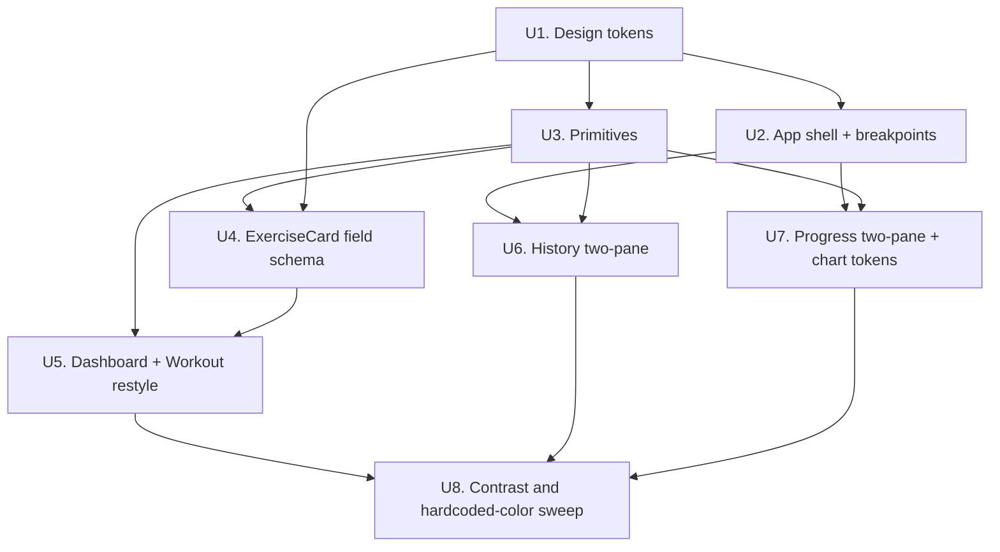

# refactor: Light palette, responsive layout, and component vocabulary

## Overview

Rebuild the presentation layer of `track-my-workout` in three coordinated
moves: a light design-token system (light blue + orange, "athletic and bold"),
three responsive breakpoints where phone stays the logger and desktop becomes a
review surface, and a small set of shared primitives extracted from code that is
already duplicated.

The app's behavior does not change. Every screen looks and lays out differently;
no screen does anything new.

---

## Problem Frame

The interface has three compounding problems (see origin:
`docs/brainstorms/2026-07-19-ui-redesign-requirements.md`):

1. **Dark, and the owner wants light** — and the dark assumption has leaked past
   the theme into `/20`-opacity section tints, ten hardcoded hex values in the
   Recharts tree, and four literal `bg-[#0f0f1a]` declarations (`src/index.css`,
   `src/components/Layout.tsx`, `src/pages/PinGate.tsx`, and `index.html` —
   note the last is outside `src/`).
2. **No responsive behavior at all** — not one `sm:`/`md:`/`lg:` class exists.
   Content is pinned to `max-w-2xl mx-auto`, so a laptop renders a phone strip
   in an empty field, and progress charts sit in a 250px box inside a narrow
   column.
3. **No component vocabulary** — the same card shell, input, badge, and spinner
   are re-implemented across files, which is precisely why the palette change is
   expensive today.

The third problem is why the first two are hard, so it is sequenced early.

---

## Requirements Trace

- R1–R8. Visual system: two-tier tokens, radius/elevation/type scales, no
  hardcoded colors, orange-as-fill-only, blue-as-structure, scarce orange,
  4.5:1 contrast, section colors on an intensity axis.
- R9–R11. Typography and density: values are the largest elements, whitespace
  over borders, 44px minimum targets.
- R12–R16. Responsive layout: three breakpoints, bottom-nav-to-left-rail,
  two-pane History and Progress, Workout stays narrow, charts scale with width.
- R17–R18. Component vocabulary: primitives with 3+ existing call sites,
  `ExerciseCard`'s three branches collapsed into a field schema.

**Origin acceptance examples:** AE1 (covers R3, R7), AE2 (covers R4, R6),
AE3 (covers R12, R15), AE4 (covers R14), AE5 (covers R18).

---

## Scope Boundaries

- **Logging behavior is unchanged.** Ghost prefill, the session cursor, and
  per-set persistence are deferred (see origin). `src/pages/Workout.tsx` keeps
  its local-state-then-save model; only its presentation changes.
- **No desktop program editor.** Templates are still edited via SQL migrations.
- **No new screens or routes.** The four existing routes stay.
- **No dark mode.** Light replaces dark. The token structure must not foreclose
  adding it later, but it is not built here.
- **No data-fetching or error-handling changes.** The ignored Supabase error
  channels stay ignored for now; `AsyncBoundary` renders the states that already
  exist rather than introducing new ones.
- **No new charts or computed insights.**
- **No test runner introduction.** The repo has none, and adding one is a
  separate decision. Verification for this plan is by exercising the app.

---

## Context & Research

### Relevant Code and Patterns

- `src/index.css` — the entire design system: one `@theme` block with 13 flat
  `--color-*` tokens, plus a `body` rule using `@apply bg-[#0f0f1a]`.
- `src/components/Layout.tsx` — app shell. Hardcodes `bg-[#0f0f1a]`, pins
  `max-w-2xl mx-auto`, fixed bottom nav.
- `src/components/ExerciseCard.tsx` — `SECTION_COLORS` map of `/20`-opacity
  tints; three near-duplicate JSX branches for weighted/bodyweight/timed; the
  numeric input class string appears verbatim four times.
- `src/pages/Progress.tsx` — chart block carries ten hardcoded hex values; the
  only Recharts consumer in the app.
- `src/components/SwapExerciseModal.tsx` — 25 references to tokens U1 deletes.
  Opened from every `ExerciseCard`, so it is on the main logging path.
- `index.html` — `<body class="bg-[#0f0f1a]">`. Tailwind scans it, and a class
  selector outranks the element rule in `index.css`.
- `src/pages/History.tsx`, `src/pages/Dashboard.tsx` — each re-implement the
  card shell, loading spinner, and empty state independently.
- `supabase/migration_003_new_plan.sql` — the revised program uses four
  sections (`explosive`, `strength`, `core`, `cardio`) and all three tracking
  types. Fewer sections than the current `SECTION_COLORS` map assumes.

### Institutional Learnings

`docs/solutions/` does not exist in this repo, so no institutional learnings
were available. `AGENTS.md` carries one directly relevant standing rule —
prefer editing existing files over adding new ones — which U3 satisfies by
extracting only proven duplication (3+ call sites each), never speculative
abstractions.

### External References

Verified against the installed tailwindcss 4.2.2, not just documentation prose:

- **Theme variable tree-shaking is the critical finding.** Tailwind v4 drops
  `@theme` variables that no utility class references. A token consumed only as
  `var(--color-chart-line)` inside TSX **will not exist at runtime**, and the
  SVG attribute falls back to black — silently, with no build error and no
  TypeScript warning. Chart tokens must live in `@theme static { }`.
- **Namespaces differ from v3 habits.** Font *size* is `--text-*`, not
  `--font-size-*`; `--font-*` is family only. Radius is `--radius-*`, not
  `--border-radius-*`. A variable in an unrecognized namespace is silently
  dropped entirely — it is not even emitted to `:root`.
- **`var()` works in SVG presentation attributes.** Confirmed in Chrome via
  `getComputedStyle` on `fill` and `stroke`. Recharts can be driven from tokens
  with no JS bridge.
- **Avoid `@theme inline` for the semantic tier.** It inlines values at build
  time and never emits the semantic variable, which erases the exact seam that
  would make dark mode a later one-liner.
- **Custom breakpoints extend rather than replace** the defaults, and mixed
  `px`/`rem` units produce wrong variant ordering — keep all breakpoints in one
  unit.
- **Container queries are native in v4** (no plugin, unlike v3).

Sources: [Theme variables](https://tailwindcss.com/docs/theme),
[Functions & directives](https://tailwindcss.com/docs/functions-and-directives),
[Responsive design](https://tailwindcss.com/docs/responsive-design),
[Dark mode](https://tailwindcss.com/docs/dark-mode).

---

## Key Technical Decisions

- **Two-tier tokens: raw ramp in plain `:root`, semantic tier in `@theme`.**
  The raw ramp generates no utilities (no `bg-gray-50` pollution); the semantic
  tier does. Non-inline `@theme` keeps semantic names as real runtime variables.
- **Chart tokens go in `@theme static`.** Directly forced by the tree-shaking
  behavior above. This is the single most likely silent failure in the plan.
- **Viewport breakpoints for the shell, container queries for the panes.** The
  single-column-vs-two-pane decision is genuinely a viewport question. Layout
  *inside* a master-detail pane depends on the space that pane actually has, so
  `@container` there keeps the pane reusable and correct when the sibling
  collapses.
- **Primitives are harvested, not designed.** Each must have 3+ existing call
  sites. This is how U3 respects the `AGENTS.md` rule rather than violating it.
- **Section intensity axis targets four sections, not six.** The revised
  program dropped `finisher` and `mobility`. The map should still handle the
  full CHECK-constraint set so an unmapped section degrades to neutral rather
  than crashing.
- **The Workout column stays narrow at every width.** Stretching a logging
  surface nobody uses on a laptop would trade real mobile ergonomics for unused
  desktop space.

---

## Open Questions

### Resolved During Planning

- *Do custom breakpoints replace Tailwind's defaults?* No — they extend. Keep
  all values in `rem` to avoid variant mis-ordering.
- *Can Recharts read CSS variables?* Yes, verified in-browser. No JS bridge.
- *Which sections need intensity mappings?* Four in the revised program;
  the map should tolerate the full seven-value CHECK set.
- *Is a typeface change required?* No custom font is configured today — the app
  uses Tailwind's default `font-sans` stack. The bold treatment needs weights
  600–800, which system stacks provide. A webfont is optional polish, not a
  prerequisite.

### Deferred to Implementation

- Exact ramp stops and final hex values: the roles and contrast floors are
  fixed; the specific values are a taste call best made against real pixels.
- Whether History/Progress master-detail uses routing or local selection state:
  depends on how the existing expand-in-place state reads once refactored.
- Whether `AsyncBoundary` is a component or a hook-plus-fragment: decide when
  the third call site is in front of you.
- Whether `Field` clears the three-call-site bar once U4's generic set-row
  exists. U3 defers the extraction precisely so this can be counted, not guessed.
- Whether the `TRACKING_FIELDS` schema belongs in `src/types/database.ts`.
  AGENTS.md calls that file "the contract between DB and UI," but this is a
  UI-rendering concern rather than a row type.
- Whether `Progress.tsx`'s `DEFAULT_METRIC` map should read from the same
  tracking-type schema. It restates the same knowledge, but merging it is not
  scoped to any unit in this plan.

---

## High-Level Technical Design

> *This illustrates the intended approach and is directional guidance for
> review, not implementation specification. The implementing agent should treat
> it as context, not code to reproduce.*

Token layering:

```
:root                     @theme                  @theme static
(private raw ramp)        (semantic → utilities)  (semantic, forced emit)
--sky-500 ─────────────►  --color-cool ────────►  --color-chart-line
--orange-600 ──────────►  --color-action          --color-chart-grid
--slate-900 ───────────►  --color-text            --color-chart-axis
                          --radius-* --shadow-*
                          --text-* --breakpoint-*
                                 │                        │
                          utility classes          var() in TSX
                          (bg-action, …)           (Recharts props)
```

The right-hand column exists solely because utilities never reference those
tokens, so ordinary `@theme` would tree-shake them away.

Unit dependency graph:



---

## Implementation Units

- [ ] U1. **Design token foundation**

**Goal:** Replace the dark theme with a light two-tier token system carrying
color, radius, elevation, and type scales, plus the three breakpoints.

**Requirements:** R1, R2, R4, R5, R7, R12

**Dependencies:** None

**Files:**
- Modify: `src/index.css`
- Modify: `index.html` (remove the `bg-[#0f0f1a]` body class — a class selector
  outranks the element rule, so the page stays dark until this is removed)

**Approach:**
- Private raw ramps in plain `:root`: a slate neutral ramp, a sky/blue ramp, an
  orange ramp. These generate no utilities.
- Semantic tier in non-inline `@theme`: `--color-bg`, `--color-surface`,
  `--color-text`, `--color-text-muted`, `--color-border`, `--color-action`,
  `--color-action-text`, `--color-cool`, `--color-cool-tint`.
- **Status roles.** Add `--color-danger`, `--color-warn`, `--color-positive`.
  The current `accent-red`/`accent-yellow`/`accent-green` tokens carry real
  meaning in roughly 24 places — PIN error text, delete hover, the Save button,
  the streak indicator, and the skip/swap badges in History. Without successor
  roles an implementer will either invent a fourth hue or reach for the scarce
  action-orange, breaking the one-orange-fill rule that R6 and AE2 depend on.
  These are status colors, not accents: they never compete for primary action.
- **Legacy aliases, temporary.** Also emit the retired token names as aliases
  pointing at the new light values (`--color-text-primary: var(--color-text)`,
  `--color-surface-light: var(--color-surface)`, and so on for all eleven).
  Without this, U1 leaves every screen referencing utilities that no longer
  exist — and because Tailwind v4 emits nothing for an unknown utility rather
  than erroring, the app renders as unstyled black-on-white and stays that way
  until U7 completes. The aliases keep the app usable for real workouts through
  the whole refactor. U8 removes them once the last call site is converted.
- Chart tokens in `@theme static`: `--color-chart-line`, `--color-chart-grid`,
  `--color-chart-axis`, `--color-chart-dot`, `--color-chart-tooltip-bg`,
  `--color-chart-tooltip-border`, `--color-chart-tooltip-text`. Static is
  required — see Context & Research. All seven are needed because `Progress.tsx`
  carries ten literals spanning grid, axis, tick, tooltip surface, tooltip
  border, tooltip text, line, and dot. Defining only the first three would send
  the implementer back into `index.css` mid-U7 to invent the rest.
- **Check contrast when the ramp values are picked, not at the end.** Verify
  text-on-bg, text-muted-on-bg, text-muted-on-surface, and
  action-text-on-action all clear 4.5:1 here. The muted tier is the predicted
  failure, and its fix is a token-value change — deferring that discovery to U8
  means re-verifying every screen already styled in U5–U7.
- Add `--radius-*`, `--shadow-*`, `--text-*` scales. Elevation matters more
  here than it did on dark, since light cannot express depth via surface
  lightness steps.
- Add `--breakpoint-*` values for the 600px and 840px thresholds in `rem`,
  consistent with the existing default units.
- Replace the `body { @apply bg-[#0f0f1a] ... }` rule with plain CSS reading
  `var(--color-bg)` and `var(--color-text)`.
- Contrast floors: orange is fill-only with white text; where orange must be
  text, use the darkened variant. All text ≥ 4.5:1.

**Patterns to follow:** The existing `@theme` block's shape — this replaces its
contents, not its location.

**Test scenarios:**
- Happy path: after the change, `bg-action`, `text-cool`, `rounded-*`, and
  `shadow-*` utilities all resolve to the new values in the browser.
- Edge case: **Covers AE1.** Inspect computed styles and confirm every
  `--color-chart-*` token is present in `:root` at runtime. Their absence is the
  expected failure if `@theme static` is omitted, and it fails silently.
- Edge case: confirm custom breakpoints did not displace Tailwind's defaults —
  `md:` and the new custom variants should both resolve.

**Verification:**
- The app renders light, and **all four routes remain legible and usable after
  this unit alone** — that is what the legacy aliases buy. Screens are not yet
  restyled to the new direction, but nothing is unstyled or unreadable.
- No token sits in an unrecognized namespace (those vanish silently).
- The four contrast pairs above clear 4.5:1 before any screen work begins.

---

- [ ] U2. **App shell and responsive scaffold**

**Goal:** Give the app its first breakpoints and convert the bottom nav to a
left rail at the wide breakpoint.

**Requirements:** R12, R13, R15

**Dependencies:** U1

**Files:**
- Modify: `src/components/Layout.tsx`

**Approach:**
- Remove the hardcoded `bg-[#0f0f1a]`; the shell reads from tokens.
- Below 600px: current single-pane layout with bottom nav, unchanged in shape.
- 600px+: content column stays constrained (~540px) rather than stretching.
- 840px+: bottom nav becomes a persistent left rail; the main region becomes the
  container that U6 and U7 place their two panes inside.
- Route-aware width: the Workout route stays constrained at every width while
  History and Progress are allowed to occupy the wide region. Keep this decision
  in the shell rather than scattering it across pages. Note this is the shell's
  first coupling to routing beyond `NavLink` — it needs `useLocation()`.
- The left rail's nav items need a visible focus-visible state, using the same
  ring treatment U3 defines for `Button` and `Chip`. Desktop is a keyboard
  surface in a way the phone-only original never was.

**Patterns to follow:** The existing `navItems` array and `NavLink` active-state
pattern — the rail reuses both, changing only orientation and styling.

**Test scenarios:**
- Happy path: at 375px, bottom nav is present and the layout matches today's
  shape.
- Happy path: at 700px, the content column is constrained rather than
  full-bleed, and the bottom nav is still present.
- Happy path: at 1440px, the left rail is visible and the bottom nav is gone.
- Edge case: **Covers AE3.** At 1440px on the Workout route, the logging column
  is centered at roughly its mobile width, not stretched.
- Edge case: resizing across each threshold does not lose navigation state or
  strand the user without a visible nav.

**Verification:**
- All four routes are reachable at all three widths.
- No hardcoded background color remains in the shell.

---

- [ ] U3. **Primitive component vocabulary**

**Goal:** Extract the shapes already duplicated across the app into shared
primitives so later units restyle in one place.

**Requirements:** R17, R10

**Dependencies:** U1

**Files:**
- Create: `src/components/ui/` (Surface, Field, Button, Chip, Stack,
  AsyncBoundary)
- Modify: call sites in `src/pages/Dashboard.tsx`, `src/pages/History.tsx`,
  `src/pages/Progress.tsx`, `src/components/ExerciseCard.tsx`

**Approach:**
- Harvest, do not invent. Each primitive must replace 3+ existing call sites:
  - `Surface` — the `bg-surface rounded-xl border border-border` shell (~8 sites)
  - `Chip` — section badge, metric toggle, "Day N" badge, "Done" badge
  - `Button` — with variant covering the orange primary and quiet icon buttons
  - `AsyncBoundary` — the duplicated spinner and empty states
- **`Surface` takes `padding` and `interactive` props.** Its call sites are not
  identical: Dashboard uses `p-3` and `p-4`, History and Progress use no padding
  plus `overflow-hidden`, ExerciseCard adds a conditional border, and Dashboard
  and Workout carry hover states. Absorbing that variance in props is what keeps
  the extraction honest; normalizing it silently would change appearance.
- **`Chip` needs static and interactive variants.** Its four call sites differ in
  interaction semantics — "Day N" and "Done" are labels, the metric toggle is a
  control with a selected state. One undifferentiated chip either makes labels
  look clickable or loses the selected-state signal the metric toggle depends on.
- `AsyncBoundary` renders only the states that already exist. It does not
  introduce error handling; the ignored Supabase error channels are out of scope.
- **`Field` is deliberately not extracted here** — see U4. Its four call sites
  all live inside `ExerciseCard` and U4 collapses them into a single generic
  set-row in the very next unit, which would leave `Field` with one consumer and
  make the threading work throwaway. Decide on extraction after U4 exists.
- **`Stack` is dropped.** Its candidate sites use materially different gap and
  spacing values layered with unrelated classes, so it would need a full
  `className` escape hatch to be usable — at which point it barely differs from
  writing the utilities directly. It also carries no color, radius, or elevation,
  so it does not serve this unit's actual goal of restyling in one place.
- If any remaining primitive turns out to have fewer than three real call sites,
  drop it rather than keeping it for symmetry.
- **Focus-visible treatment is defined here**, once, for `Button` and `Chip`: a
  consistent ring drawn from `--color-action` or `--color-cool`, mirroring the
  `focus:ring-primary` pattern the form inputs already use. Desktop is now a
  keyboard-and-mouse surface, and contrast alone does not make focus visible.

**Execution note:** Convert call sites incrementally and keep the app running
between primitives — there is no test suite to catch a bad extraction, so short
feedback loops are the only safety net.

**Patterns to follow:** Existing default-export function-component style; no
class components; `import type` for type-only imports.

**Test scenarios:**
- Happy path: each screen shows no *unintended* change from its pre-extraction
  state. Deliberate normalization absorbed into `Surface` props is expected and
  fine; anything else is a regression.
- Edge case: `AsyncBoundary` renders the correct branch for loading, empty, and
  populated states on History and Progress.
- Edge case: `Chip` renders label variants without a clickable affordance, and
  the metric toggle retains a visible selected state.
- Edge case: keyboard-tabbing through a page shows a visible focus ring on every
  `Button` and interactive `Chip`.

**Verification:**
- Every extracted primitive has 3+ real call sites.
- No screen changed appearance except where `Surface` props deliberately
  normalized it.
- Focus is visible on every interactive element via keyboard alone.

---

- [ ] U4. **ExerciseCard field schema and section intensity axis**

**Goal:** Collapse three near-duplicate tracking-type branches into one
declarative schema, and replace the six-hue section map with an intensity axis.

**Requirements:** R8, R18

**Dependencies:** U1, U3

**Files:**
- Modify: `src/components/ExerciseCard.tsx`
- Modify: `src/types/database.ts` (if the schema map is co-located with types)

**Approach:**
- A map keyed by `tracking_type` describes which fields render, each with key,
  label, and input mode. One generic set-row renders from that list and derives
  its grid template from field count.
- `SECTION_COLORS` becomes a warm-to-cool intensity mapping. The revised program
  uses four sections; the map should still cover the full seven-value CHECK set
  so an unmapped section degrades to neutral rather than throwing.
- **The warm pole must not be `--color-action`.** Section chips appear many
  times per screen, so mapping the hot end to the action-orange would put a
  dozen orange fills on a workout screen and break the one-orange-fill rule that
  R6 and AE2 assert — a violation U8 would only catch at the very end. Use a
  separate warm token that sits outside the action budget, muted enough to read
  as an intensity label rather than a call to action.
- Tints must be real token values, not `/20` opacity over a dark surface — that
  construction is what breaks on light.
- Once the generic set-row exists, decide whether the numeric input warrants
  extraction into a shared `Field` primitive (U3 deliberately deferred this). It
  now has one call site here, but `PinGate`, `SwapExerciseModal`, and Progress's
  select share the same input shell — count app-wide before deciding, and follow
  the AGENTS.md default of not adding a file if the count stays below three.

**Technical design:** *(directional, not specification)*

```
TRACKING_FIELDS
  weighted   → [ weight_kg (Kg, decimal), reps (Reps, numeric) ]
  bodyweight → [ reps (Reps, numeric) ]
  timed      → [ duration_sec (Duration, numeric) ]

SetRow renders fields.map(...) and sets grid-template-columns from fields.length
```

**Patterns to follow:** The existing `DEFAULT_METRIC` map in
`src/pages/Progress.tsx` is the same idea applied to metrics — mirror its shape.
That file restates tracking-type knowledge and is a candidate to read from the
same schema later.

**Test scenarios:**
- Happy path: a weighted exercise renders kg and reps inputs; bodyweight renders
  reps only; timed renders duration only. All three match current behavior.
- Happy path: **Covers AE5.** Adding a hypothetical fourth entry to the schema
  renders its fields without touching JSX.
- Edge case: an exercise whose section is not in the intensity map renders with
  neutral styling rather than crashing.
- Edge case: skip and swap controls still work, and swapped exercises still show
  their `original_exercise` attribution.
- Integration: values entered through the schema-driven rows still reach
  `onUpdate` with the correct field keys, so `Workout.tsx` saves unchanged data.

**Verification:**
- `ExerciseCard.tsx` is materially shorter and contains one set-row
  implementation rather than three.
- A full workout can be logged and saved with data identical to pre-refactor.

---

- [ ] U5. **Dashboard and Workout restyle**

**Goal:** Apply the athletic-and-bold treatment to the two screens the owner
touches during a session.

**Requirements:** R6, R9, R10, R11, R15

**Dependencies:** U3, U4

**Files:**
- Modify: `src/pages/Dashboard.tsx`, `src/pages/Workout.tsx`,
  `src/components/ExerciseCard.tsx`, `src/pages/PinGate.tsx`,
  `src/components/SwapExerciseModal.tsx`

**Approach:**
- Values (weight, reps, duration, streak, counts) become the largest, heaviest
  elements. Labels become small, uppercase, low-emphasis.
- Separation from whitespace and weight rather than borders and filled surfaces.
- Exactly one orange-filled primary action per screen.
- Set inputs sized for arm's-length reading with the phone propped: at least
  44px targets, and numerals large enough to read at reduced brightness.
- `PinGate` is included because it is the first screen seen and would otherwise
  remain visibly dark-themed. `SwapExerciseModal` is included because it carries
  25 references to retired tokens and opens from every `ExerciseCard`, putting it
  squarely on the logging path — it is the one file the original unit list missed.
- Skipped exercises need a replacement signal. The current `opacity-50`
  treatment reads as illegible mush on a light ground, and line-through plus a
  "Skipped" label may not carry it alone — use the `--color-danger` status role
  and a distinct surface treatment rather than fading the card.

**Patterns to follow:** U3's primitives — this unit should mostly compose them,
not write new class strings.

**Test scenarios:**
- Happy path: **Covers AE2.** On Dashboard, exactly one orange-filled action is
  present and no orange text sits directly on the light background.
- Happy path: a full workout can be logged end to end at 375px width.
- Edge case: all interactive targets during logging measure at least 44px.
- Edge case: the longest exercise names in the seeded program do not overflow or
  truncate awkwardly at the narrowest supported width.
- Edge case: skipped exercises remain visually distinguishable without relying
  on the `opacity-50` trick, which reads as illegible mush on light.
- Edge case: the swap modal opens from an exercise card and renders correctly at
  375px and 1440px — its search input, category chips, and result list all read
  against the light ground.
- Edge case: no workout screen shows more than one orange fill, including when
  several high-intensity section chips are visible at once.

**Verification:**
- A workout is logged and saved successfully on a phone-width viewport.
- Values are the visually dominant element on every card.

---

- [ ] U6. **History two-pane layout**

**Goal:** Give History a real wide layout and restyle it.

**Requirements:** R12, R14, R10

**Dependencies:** U2, U3

**Files:**
- Modify: `src/pages/History.tsx`

**Approach:**
- Below 840px: current list with expand-in-place, restyled.
- 840px+: session list in the left pane, selected session detail in the right
  pane, both visible at once.
- **Selection states must be specified, not left to the implementer.** Session
  detail is fetched lazily per session today, so three states need definitions:
  the right pane on first arrival with sessions present but none selected
  (default to the most recent session rather than an empty pane); the pane while
  a newly-selected session's detail is in flight (show a loading state — letting
  the previous session's data linger reads as a bug); and the selected row's
  highlight treatment in the list.
- Apply R9's value hierarchy here too. Set data in session detail — weights,
  reps, durations — should be the dominant type, matching what U5 does on
  Dashboard and Workout. Leaving History on generic list typography would make
  the app read as two design systems stitched together.
- Use `@container` for layout inside each pane so the panes stay correct if one
  collapses.
- **Pre-existing bug in the path this unit rewrites.** The select at
  `src/pages/History.tsx:39` omits `tracking_type`, so the render at line 167
  (`ex.exercise?.tracking_type || 'weighted'`) always takes the fallback —
  bodyweight and timed exercises display as "0kg × N reps" in History today.
  This plan did not introduce it, but the implementer will be standing in the
  code when they hit it. Adding `tracking_type` to the select is a one-word fix;
  take it rather than faithfully reproducing the bug in the new layout.
- Replace the bare `confirm(` call at `src/pages/History.tsx:64` for deletes
  with a styled confirmation. Note it is the bare global, not `window.confirm()`
  — a grep for the latter finds nothing and would pass vacuously.
- **This one item is a behavior change, not a restyle**, and the plan's
  "no screen does anything new" claim is scoped to logging and data flow rather
  than to every interaction. A styled dialog replaces a synchronous boolean with
  pending-delete state and two control-flow paths, so it needs its own cancel
  path and test coverage. It traces to no R-number in the origin document; it is
  included because leaving one raw browser dialog in an otherwise redesigned app
  is a visible seam. If that trade is unwanted, cut it — nothing else depends
  on it. The same reasoning applies to the `alert()` at
  `src/pages/Workout.tsx:161`, which is the other piece of raw browser chrome;
  it is left alone here because it sits on the save path this plan does not touch.

**Test scenarios:**
- Happy path: **Covers AE4.** At 1440px, selecting a session shows the list and
  the detail simultaneously without navigation.
- Happy path: at 375px, expand-in-place behaves as it does today.
- Edge case: with zero sessions, the empty state renders correctly in both
  single-pane and two-pane layouts — the right pane needs its own empty state.
- Edge case: deleting the currently-selected session in two-pane mode clears or
  reassigns the detail pane rather than leaving a stale render.
- Edge case: cancelling the styled confirmation leaves the session present and
  clears pending-delete state, at both single-pane and two-pane widths. This is
  the branch the refactor actually introduces.
- Edge case: switching between sessions at 1440px shows a loading state rather
  than the previously-selected session's data.
- Edge case: arriving at History at 1440px with sessions present shows a
  populated right pane, not an empty one.
- Integration: deletion still removes the session and its cached exercise
  details from local state.

**Verification:**
- Sessions are viewable and deletable at all three widths.
- No bare `confirm(` remains in `src/pages/History.tsx`.

---

- [ ] U7. **Progress two-pane layout and chart tokenization**

**Goal:** Remove the last hardcoded colors and give charts room to breathe.

**Requirements:** R3, R14, R16

**Dependencies:** U1, U2, U3

**Files:**
- Modify: `src/pages/Progress.tsx`

**Approach:**
- Replace all ten hardcoded hex values with `var(--color-chart-*)` and
  semantic token references. `var()` in SVG presentation attributes is verified
  working; `tick` and `contentStyle` are React style objects and accept `var()`
  unambiguously.
- Below 840px: the picker stays a native `<select>` above the chart, restyled.
- 840px+: the picker becomes a **scrollable, selectable list mirroring U6's
  session list** — not a widened native `<select>`, which would look unfinished
  in a full pane. Reuse U6's selected-row highlight and keyboard navigation so
  the two review surfaces share one interaction vocabulary; that shared pattern
  is part of what this refactor is buying.
- The chart's right pane needs the same first-arrival and selection-switching
  states U6 defines: default to a sensible exercise rather than an empty pane,
  and show a loading state between selections.
- Apply R9's value hierarchy to the data table beneath the chart, matching U5
  and U6.
- Chart height scales with available width instead of the fixed 250px. If the
  chart moves into a flex or grid child, pin an explicit height on the wrapper —
  `ResponsiveContainer` collapses to zero inside an auto-height parent.

**Test scenarios:**
- Happy path: **Covers AE1.** Grid, axes, tooltip, and line all render legibly
  on the light ground with no dark-theme remnant.
- Edge case: chart tokens resolve at runtime — a dropped token yields a black or
  invisible stroke with no error, so this needs an explicit visual check.
- Edge case: **verify strokes and fills resolve on mobile Safari, not only
  Chrome.** The `var()`-in-SVG-presentation-attribute support was confirmed in
  Chrome only, and WebKit is the least uniform implementation of that path — yet
  a propped-up phone is this app's primary surface. If it fails there, the
  fallback is to move stroke and fill onto a CSS class targeting the Recharts
  elements, or resolve tokens once via `getComputedStyle` and pass literals.
  `tick` and `contentStyle` are React style objects and are safe either way.
- Edge case: an exercise with no logged sessions shows the empty state rather
  than an axis-only chart.
- Edge case: a single data point renders without the line disappearing.
- Edge case: the chart does not collapse to zero height at any of the three
  breakpoints.

**Verification:**
- No hex literal remains anywhere in `src/pages/Progress.tsx`.
- Charts are readable at 375px, 700px, and 1440px.

---

- [ ] U8. **Contrast and hardcoded-color sweep**

**Goal:** Verify the redesign's invariants hold across the whole app.

**Requirements:** R3, R6, R7, R11

**Dependencies:** U5, U6, U7

**Files:**
- Modify: any file the sweep finds in violation

**Approach:**
- Grep the repo root (excluding `node_modules`, `dist`, and `src/assets`) for
  hex literals, `rgb(`, and arbitrary-value color classes. `index.html` sits
  outside `src/` and must be in scope. Every hit is either converted to a token
  or explicitly justified.
- **Second pass, for stale token names.** The grep above structurally cannot
  find this refactor's dominant failure mode: a surviving reference to a token
  U1 deleted. Those are plain named utilities, so they match no hex or
  arbitrary-value pattern, produce no build error, and no TypeScript warning —
  they simply render unstyled. Grep for each retired name and require zero hits:
  `primary`, `primary-dark`, `surface-light`, `surface-lighter`, `accent-green`,
  `accent-red`, `accent-yellow`, `accent-blue`, `text-primary`, `text-secondary`,
  `text-muted`. Also check the three literal `text-white` uses, since the
  orange-fill-with-white-text rule depends on them.
- **Remove U1's legacy token aliases**, then confirm the app still renders
  correctly. The aliases existed only to keep the app usable mid-refactor; if
  anything breaks when they go, that is a call site U5–U7 missed, and this is
  exactly the check designed to surface it.
- Audit text contrast against its actual background on every screen; confirm
  ≥ 4.5:1. U1 already checked the token pairs themselves, so this pass is about
  composition — text over surfaces, chips, and chart backgrounds.
- Confirm every interactive target is at least 44px on touch — including the
  delete buttons and chevrons in History and the picker rows in Progress, not
  just the logging inputs. These are touched on the same phone.
- Confirm focus is visible on every interactive element via keyboard alone,
  across all four routes.
- Confirm the orange budget: at most one orange-filled primary action visible
  at a time, and no orange text on the light ground.
- Walk all four routes at 375px, 700px, and 1440px.

**Test scenarios:**
- Happy path: grep for color literals across the repo root returns no
  unjustified hits, `index.html` included.
- Happy path: grep for each of the eleven retired token names returns zero hits
  across `src/`.
- Edge case: contrast holds for the muted text tier, which is the most likely
  failure — it passes on dark and often fails when naively ported to light.
- Edge case: `PinGate`, loading states, and empty states are all checked. They
  are easy to miss because they are rarely on screen.

**Verification:**
- Every origin acceptance example (AE1–AE5) is satisfied.
- All four routes render correctly at all three widths.

---

## System-Wide Impact

- **Interaction graph:** U3's primitives touch every page. A bad extraction
  propagates everywhere at once, which is why U3 carries an incremental
  execution note.
- **Shippable checkpoints:** with U1's legacy aliases in place, every unit
  boundary is a shippable state — the app stays usable for real workouts
  throughout. Without them there would be no safe stopping point between U1 and
  U8, which matters because this is the owner's actual training log, not a
  staging environment.
- **Error propagation:** Unchanged by design. `AsyncBoundary` renders existing
  states; it does not add error handling. The ignored Supabase error channels
  remain a known, deliberately deferred gap.
- **State lifecycle risks:** U4 touches the path that feeds `onUpdate` and
  therefore what `Workout.tsx` persists. A field-key regression would write
  wrong or empty set data silently, since nothing validates the shape.
- **API surface parity:** None — no API, route, or schema changes.
- **Integration coverage:** With no test runner, the only proof that logging
  still works end to end is exercising it. Do that after U4 and again after U5.
- **Unchanged invariants:** The Supabase schema, all four routes, the local-state
  save model in `Workout.tsx`, the PIN gate mechanism, and every query shape are
  explicitly unchanged. `src/types/database.ts` row types stay as they are.

---

## Risks & Dependencies

| Risk | Mitigation |
|---|---|
| Chart tokens tree-shaken out; strokes silently render black | Declare them in `@theme static`; U1 and U7 both carry an explicit runtime check |
| A token lands in an unrecognized namespace and vanishes | U1 verifies utilities resolve in-browser rather than trusting the source file |
| U4 regresses which data reaches `onUpdate`, corrupting saved sets | Log and save a full workout after U4, comparing stored rows to pre-refactor |
| No test suite to catch regressions anywhere | Incremental conversion with the app running; per-unit verification is behavioral, not structural |
| App unusable for real workouts mid-refactor | U1's legacy token aliases keep every screen coherent through U2–U7; U8 removes them last |
| A retired token name survives in some call site | U8's second grep pass over the eleven retired names; removing the aliases in U8 turns any survivor into a visible break |
| Muted text tier fails contrast after the port | Checked in U1 when ramp values are picked, not deferred to U8 — the fix is a token change and late discovery means re-verifying every styled screen |
| `var()` in SVG fails on iOS Safari, the primary device | U7 verifies on mobile Safari explicitly; documented fallback is a CSS class or `getComputedStyle` resolution |
| Section intensity chips consume the orange budget | U4 mandates a warm token distinct from `--color-action`; U5 tests for at most one orange fill per screen |
| Program revision changes sections or tracking types mid-flight | U4 tolerates unmapped sections; land `migration_003_new_plan.sql` before U4 if possible |
| Blue + orange reads as a dated sports brand | Orange is fill-only and budgeted at one action per screen; neutral ground carries surface area |

---

## Documentation / Operational Notes

- No user-facing docs exist to update.
- Consider capturing the Tailwind v4 tree-shaking behavior in `docs/learnings/`
  once confirmed in practice — it is exactly the kind of non-obvious, costly
  discovery that directory exists for.
- `AGENTS.md` will need its Conventions section updated once `src/components/ui/`
  exists, since it currently states there are no shared UI primitives.

---

## Sources & References

- **Origin document:** [docs/brainstorms/2026-07-19-ui-redesign-requirements.md](docs/brainstorms/2026-07-19-ui-redesign-requirements.md)
- **Ideation trail:** [docs/ideation/2026-07-19-ui-redesign-ideation.md](docs/ideation/2026-07-19-ui-redesign-ideation.md)
- Related code: `src/index.css`, `src/components/Layout.tsx`,
  `src/components/ExerciseCard.tsx`, `src/pages/Progress.tsx`
- External docs: [Tailwind v4 theme variables](https://tailwindcss.com/docs/theme),
  [Responsive design](https://tailwindcss.com/docs/responsive-design)
